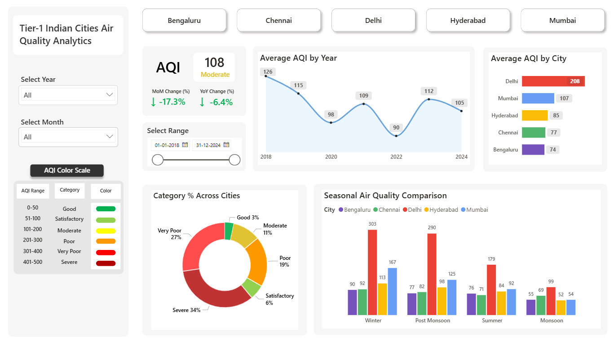

# Air Quality Analytics Tier-1 Cities

## 📸 Dashboard Preview

## 📊 Data Model

Power BI dashboard analyzing AQI trends (2018–2024) using star schema modeling, DAX time intelligence, and KPI reporting.

The goal is to uncover:

📈 Year-over-Year pollution trends

🌍 City-wise AQI comparison

⚠️ Pollution seasonality patterns

🔎 Key pollutant impact (PM2.5 focus)

This dashboard transforms raw environmental data into actionable insights for policy evaluation and urban planning.

### 🎯 Objectives
- Identify the most polluted Tier-1 cities
- Analyze AQI trend progression (2018–2024)
- Detect seasonal pollution spikes
- Measure Year-over-Year % changes
- Compare cities using dynamic visuals

### 🗂 Dataset

- Source: CPCB / Open-source AQI datasets
- Time Period: 2018–2024
- Granularity: Daily observations
- Focus Metric: AQI & PM2.5

### 🛠 Tools & Technologies

- Power BI
- DAX (Time Intelligence, YoY, MTD)
- Data Modeling
- Power Query (Data Cleaning & Transformation)

### 📊 Key Dashboard Features

- AQI Trend Analysis (Line Charts)
- Year-over-Year % Change Indicator

- City Comparison Dashboard

- Dynamic Filters (Year, City)

- Trend Arrows for Performance Direction

- Seasonal Variation Insights

### 🔍 Key Insights

- Certain cities show consistent YoY improvement.
- Post-2020 trends reveal structural changes in pollution levels.
- Winter months show significant AQI spikes across all major cities.
- PM2.5 strongly correlates with overall AQI variation.

### 🚀 Business Relevance
This analysis can support:
- Environmental policy evaluation
- Urban sustainability planning
- Public health awareness initiatives
- Government pollution control strategies

